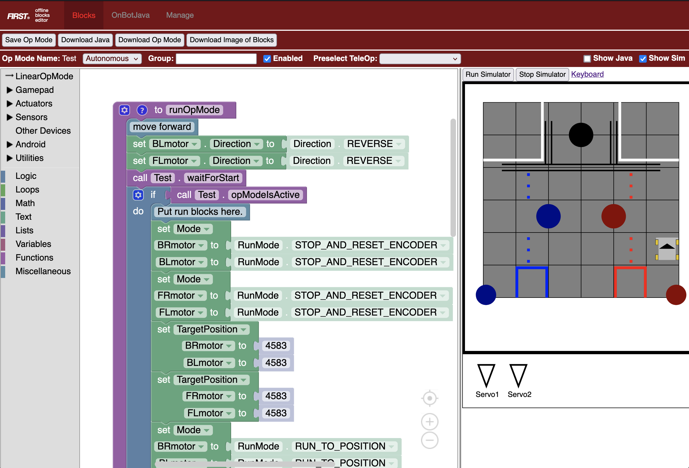

# FTC Robotics Programming simulator

This project is a hacked version of the FTC offline blocks editor that includes
a simulated robot. This allows teams to teach and test robot programming without
requiring a physical robot.

# Deploying

## Using netlify

The [netlify.toml](netlify.toml) file can be used with
[netlify](https://www.netlify.com/) to automatically build and deploy the
simulator.

## Manual

Running the [build.sh](build.sh) script will generate the site in the `build`
directory. The files in this directory can then be deployed on any web server.

## Local testing

The code can be tested either by using the netlify cli tool and running `netlify
dev` or by manually building and running a web server out of the `build`
directory. For example `python3 -m http.server 8080`.

# Using the simulator

The simulator is hidden by default but can be shown by toggling the `Show Sim`
checkbox. It's often useful to hide the Java pane by un-checking the `Show Java`
checkbox.

Once the simulator is shown, the pane can be enlarged by sliding the vertical
divider between the simulator and the code pane. The simulator can be started by
clicking the `Run Simulator` button and stopped by clicking the `Stop Simulator`
button.

## Controlling the robot

The robot can be controlled using the keyboard. Click on the `Keyboard` link
next to the `Stop Simulator` button to see the mapping from the gamepad controls
to the keyboard.

You can also drive the robot by connecting a gamepad to your computer. This only
works as gamepad1.

# Updating

The simulator depends on the files and configuration from a standard FTC robot
controller. To update the simulator for a new season or with a new config:

1. Download a new offline editor zip file from a standard FTC robot controller.

2. Unzip the editor and put the files into the
   [offline_blocks_editor](offline_blocks_editor) directory.

3. Re-run the build script and deploy.

# Implementation

The stock FTC Blockly implementation already includes code to generate
javascript from the blocks. The simulator uses that implementation to generate
javascript that can be run using the
[JS-Interpreter](https://github.com/NeilFraser/JS-Interpreter). The simulator
adds code to this environment to simulate the physics of a basic robot and
updates an svg representation of the robot.

## Limitations

 - Only a limited subset of the blocks logic is implemented in the simulator.
   We have slowly added code as we've needed it.

 - The keyboard interface will trigger both `gamepad1` and `gamepad2` inputs
   simultaneously.
   
 - An external gamepad only operates as `gamepad1` there is no ability to use a
   physical `gamepad2` currently.

 - The simulator has to be manually updated to match the robot config. For
   example the physical simulation depends on fixed names of the motors driving
   the wheels.
